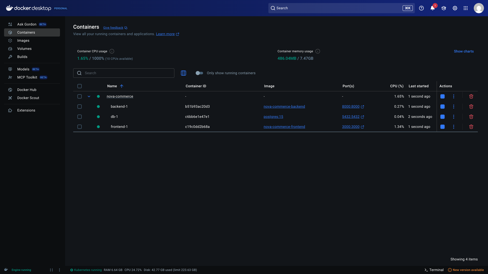
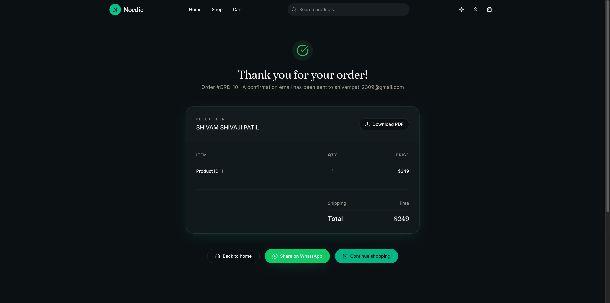

# 🚀 Nova Commerce – Full-Stack Cloud-Native Platform

Nova Commerce is a high-performance, containerized e-commerce application designed with a **DevOps-first** approach. It features a modern React frontend, a FastAPI backend, and a robust CI/CD pipeline deploying to AWS.


---

## 🏗️ Architecture Overview

The project is architected as a set of decoupled services orchestrated via **Docker Compose** and deployed on **AWS infrastructure**.

### 💻 Tech Stack

| Layer | Technology |
| :--- | :--- |
| **Frontend** | React 19, TanStack Start/Router, Tailwind CSS 4, Shadcn UI |
| **Backend** | Python, FastAPI, SQLModel (SQLAlchemy + Pydantic) |
| **Database** | PostgreSQL (Amazon RDS) |
| **DevOps** | Docker, GitHub Actions, AWS EC2, Amazon RDS |
| **Package Manager** | Bun / NPM |

---

## 🛠️ DevOps & Infrastructure (Core Focus)

This project serves as a demonstration of production-grade DevOps practices:

### 1. Containerization
Every component of the stack is fully containerized. This ensures consistent "it-works-on-my-machine" behavior from local development to cloud production.
*   **Backend:** Optimized Python-slim image.
*   **Frontend:** Standardized Node environment.
*   **Orchestration:** Multi-container management using Docker Compose.



### 2. CI/CD Pipeline (GitHub Actions)
A fully automated pipeline handles the build, test, and deployment phases:
- **Build & Push:** Automatically builds Docker images and pushes them to Docker Hub on every commit to `main`.
- **Auto-Deployment:** Connects to the AWS EC2 instance via SSH, pulls the latest images, and restarts the services with zero manual intervention.


### 3. AWS Cloud Deployment
- **EC2:** Hosts the application services.
- **RDS (PostgreSQL):** A managed database service providing high availability and security.
- **Security:** All secrets (SSH keys, DB credentials) are managed via GitHub Secrets.

---

## ✨ Key Features

- **Dynamic Product Catalog:** Fast data fetching using TanStack Query.
- **Type-Safe Routing:** End-to-end type safety between frontend and backend.
- **Order Management:** Full checkout flow from cart to order confirmation.
- **Modern UI/UX:** Built with Tailwind 4 and Radix UI components for a premium feel.



---

## 🚀 Local Development

### Prerequisites
- Docker & Docker Compose
- Bun or NPM

### Setup Instructions

1. **Clone the repository:**
   ```bash
   git clone https://github.com/shivam0023/nova-commerce.git
   cd nova-commerce
   ```

2. **Backend Setup:**
   ```bash
   cd backend
   # Create a .env file with your DATABASE_URL
   pip install -r requirements.txt
   uvicorn main:app --reload
   ```

3. **Frontend Setup:**
   ```bash
   cd frontend
   bun install
   bun run dev
   ```

4. **Run everything with Docker:**
   ```bash
   docker-compose up --build
   ```

---

## 📈 Future Roadmap
- [ ] Implement Multi-stage Docker builds for production optimization.
- [ ] Add Terraform scripts for Infrastructure as Code (IaC).
- [ ] Integrate Prometheus & Grafana for real-time monitoring.
- [ ] Implement Redis for session caching.

---

**Developed by [Shivam](https://github.com/shivam0023)**  
*Focusing on building scalable, automated, and high-performance cloud applications.*
